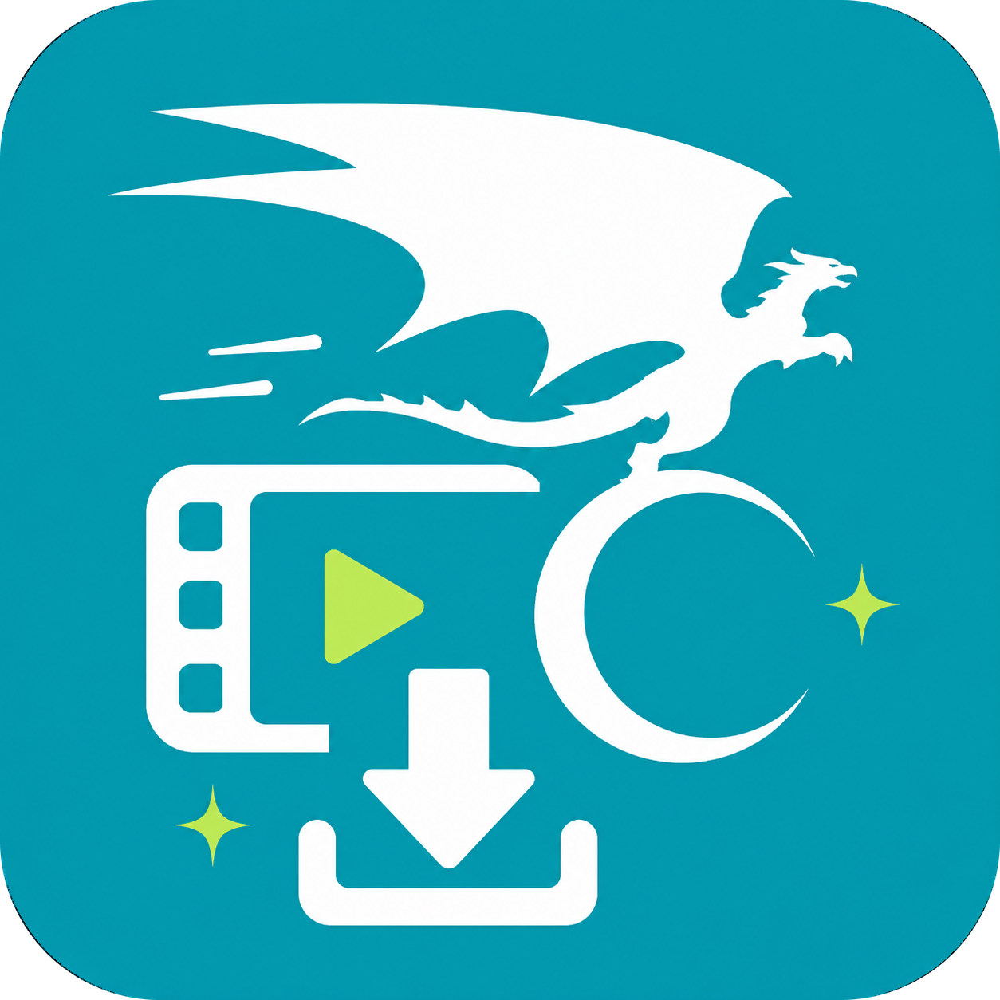

<p align="center">
  
</p>

<p align="center">Your Anime, docked at home.</p>

# AniDock

An opinionated human-like local-first anime downloader from ani gamer.

> [!WARNING]
> AniDock is under active development. The core parsing and download
> engine is working, but the desktop client and Docker server have
> not been released yet.

> [!WARNING]
> This is only for personal use, user should obey ani gamer's Terms
> of Service or local laws.

## Getting Started

AniDock now does not provide desktop client and Docker server yet.
You can only add this as a git dependency using cargo, then use api
in this crate.

Prerequisites:

- ffmpeg installed which is configure in PATH.

```rust
use std::{
    error::Error,
    sync::{Arc, Mutex},
};

use ani_dock::{Anime, Config, Cookie, DeviceId, RequestClient};
use tokio::fs;

async fn download_3499() -> Result<(), Box<dyn Error>> {
    let device_id = DeviceId::default();
    // config AniDock
    let config = Arc::new(Mutex::new(Config::default()));
    // use your cookie
    let cookie = Cookie::new(cookie_string);
    let request_client = Arc::new(RequestClient::new(&config.lock().unwrap(), &cookie)?);

    // resolve anime from one of its episode's sn
    let anime = Anime::from_episode_sn(3499, device_id, request_client, config).await?;

    // choose first episode to download
    anime
        .episodes()
        .first()
        .unwrap()
        .1
        .first()
        .unwrap()
        .download()
        .await?;

    Ok(())
}
```

## Acknowledgements

- [aniGamerPlus](https://github.com/miyouzi/aniGamerPlus)
