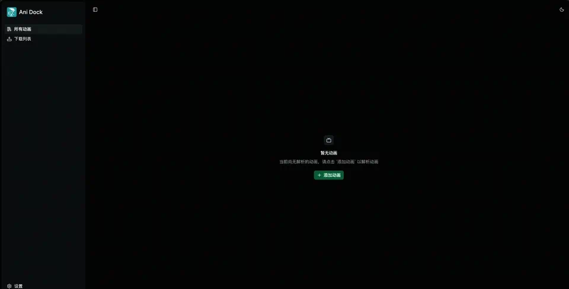

<p align="center">
  
</p>

<h1 align="center">AniDock</h1>

<p align="center">Your Anime, docked at home.</p>

<p align="center">
  <a href="https://github.com/yuzheng14/ani-dock/actions/workflows/ci.yml"></a>
  <a href="https://github.com/yuzheng14/ani-dock/releases/latest"></a>
  <a href="https://github.com/yuzheng14/ani-dock/pkgs/container/ani-dock"></a>
</p>

<p align="center">
  English · <a href="./README.zh-CN.md">简体中文</a> · <a href="./README.zh-TW.md">繁體中文</a>
</p>

Paste an AniGamer episode SN, choose the episodes you want, and let AniDock
handle the rest.

AniDock imports the entire anime, manages the download queue, and keeps
everything on your own device through a self-hosted web interface.

<p align="center">
  
</p>

## How it works

1. 🔎 **Paste an episode SN.** AniDock imports the entire anime.
2. ✅ **Choose your episodes.** Select exactly what you want to download.
3. 📥 **Follow the progress.** Watch each episode move through preparation,
   download, and merge.

## Features

- 🖥️ **Manage everything from your browser.** Configure AniDock, organize your
  library, and monitor downloads from a personal computer, NAS, or VPS.
- 💾 **Keep your data close.** Store the library, unfinished queue, Cookie,
  configuration, and downloaded files locally.
- 🔄 **Pick up where you left off.** Resume unfinished downloads after a
  restart.
- ⚙️ **Download your way.** Tune resolution, resolution locking, VIP-only
  downloads, segmented download concurrency, ad wait time, User-Agent, and
  proxy settings.
- ⏱️ **Leave the queue running.** Schedule downloads sequentially with a
  human-like cooldown.
- 🐳 **Deploy almost anywhere.** Run on `linux/amd64` and `linux/arm64` with
  FFmpeg already included in the container image.

## Before you start

AniDock is an early-stage `0.x` project, so configuration and behavior may
change between releases.

AniDock is intended for personal use only. You are responsible for complying
with AniGamer's Terms of Service and applicable laws. AniDock is not affiliated
with or endorsed by AniGamer.

> [!WARNING]
> AniDock has no built-in authentication. Keep the default loopback binding and
> do not expose it directly to the public internet. The Cookie stored by
> AniDock is an account credential; never share it or include it in logs or
> issue reports. For remote access from a NAS or VPS, use a trusted private
> network, VPN, or authenticated reverse proxy.

## Quick start

### Requirements

- Docker Engine or Docker Desktop.
- Docker Compose v2 and curl when using the Compose instructions.
- Access to AniGamer from the machine running AniDock.

### Start with Docker

Docker Compose is not required. You can run the published image directly:

```bash
docker volume create ani-dock-data

docker run -d \
  --name ani-dock \
  --restart unless-stopped \
  --init \
  --read-only \
  --tmpfs /tmp \
  --cap-drop ALL \
  --security-opt no-new-privileges:true \
  --stop-timeout 30 \
  -p 127.0.0.1:6789:6789 \
  -v ani-dock-data:/home/anidock/.ani-dock \
  ghcr.io/yuzheng14/ani-dock:latest
```

### Start with Docker Compose

Only the Compose file is required; you do not need to clone the whole
repository:

```bash
mkdir -p ani-dock
cd ani-dock

curl -fsSL \
  https://raw.githubusercontent.com/yuzheng14/ani-dock/main/docker-compose.yaml \
  > docker-compose.yaml

docker compose pull ani-dock
docker compose up -d --no-build
```

Open <http://127.0.0.1:6789> after the container becomes healthy.

The Compose file defaults to `ghcr.io/yuzheng14/ani-dock:latest`. Set
`ANI_DOCK_IMAGE` to a version tag such as
`ghcr.io/yuzheng14/ani-dock:0.1.0` if you want reproducible deployments.
Available image tags are listed on the
[container package](https://github.com/yuzheng14/ani-dock/pkgs/container/ani-dock)
page.

### Store data in a host directory

Both deployment examples store all application data in the `ani-dock-data`
named volume by default. To make the downloaded files directly accessible on
the host, set the volume source before the first start:

```bash
mkdir -p ./data
```

The container runs as UID and GID `10001`. On Linux, make the directory
writable by that user when necessary:

```bash
sudo chown -R 10001:10001 ./data
```

On a NAS without shell or `chown` access, grant UID `10001` write permission
to the selected directory in the NAS management interface. You can also keep
the named volume if the NAS does not expose Unix ownership controls.

For Docker Compose, set the host directory and start the service:

```bash
export ANI_DOCK_VOLUMES=./data
docker compose up -d --no-build
```

You can place `ANI_DOCK_IMAGE`, `ANI_DOCK_VOLUMES`, and other Compose
overrides in the deployment directory's `.env` file instead of exporting them
for every shell session.

For a direct Docker deployment, replace
`-v ani-dock-data:/home/anidock/.ani-dock` in the `docker run` command with
`-v "$(pwd)/data:/home/anidock/.ani-dock"`.

## First-time setup

1. Open **设置** in AniDock.
2. To use an authenticated account, copy the `Cookie` request header from an
   authenticated AniGamer browser request and enter the same browser's
   User-Agent. Keep both values private. Without an authenticated Cookie,
   AniDock uses guest access and can download only at 360p.
3. Configure the desired resolution, proxy, and download behavior, then choose
   **提交**. Follow the restart instructions shown by AniDock when required.
4. Open **所有动画**, choose **添加动画**, and enter the numeric `sn` from an
   AniGamer episode URL, for example `animeVideo.php?sn=3499`.
5. Choose **下载**, select the episodes, choose **确认**, and monitor them on
   the **下载列表** page.

## Data and downloads

The persistent volume is mounted at `/home/anidock/.ani-dock` in the container
and contains:

| Path | Contents |
| --- | --- |
| `config.toml` | Application configuration. |
| `cookie.txt` | AniGamer Cookie. Treat this file as a secret. |
| `data.db` | Library and download queue database. |
| `bangumi/` | Completed video files, grouped by series and season. |
| `tmp/` | Temporary download files. |

Back up the persistent volume or host directory before replacing or removing
it.

## Container operations

### Docker Compose

```bash
# View status and health
docker compose ps

# Follow logs
docker compose logs -f ani-dock

# Restart the service
docker compose restart ani-dock

# Stop the application without deleting persistent data
docker compose down
```

### Docker

```bash
# View status and health
docker ps -f name=ani-dock

# Follow logs
docker logs -f ani-dock

# Restart the container
docker restart ani-dock

# Stop the container without deleting persistent data
docker stop ani-dock
```

To update a deployment that uses the published image:

```bash
curl -fsSL \
  https://raw.githubusercontent.com/yuzheng14/ani-dock/main/docker-compose.yaml \
  > docker-compose.yaml
docker compose pull ani-dock
docker compose up -d --no-build
```

Keep any custom `ANI_DOCK_IMAGE` or `ANI_DOCK_VOLUMES` overrides exported or
saved in `.env` while running these commands.

For a direct Docker deployment, pull the new image, remove the old container,
and repeat the `docker run` command above. The named volume is not deleted when
the container is removed:

```bash
docker pull ghcr.io/yuzheng14/ani-dock:latest
docker stop ani-dock
docker rm ani-dock
```

## Build from source

The Docker build contains the frontend, Rust server, FFmpeg, and all runtime
dependencies:

```bash
git clone https://github.com/yuzheng14/ani-dock.git
cd ani-dock

ANI_DOCK_IMAGE=ani-dock:local docker compose up -d --build
```

## Reporting issues

[Open an issue](https://github.com/yuzheng14/ani-dock/issues/new) with the
AniDock version or image tag, deployment method, reproduction steps, and
relevant logs. Remove Cookies, tokens, account identifiers, and other sensitive
values before posting logs publicly.

## Acknowledgements

- [aniGamerPlus](https://github.com/miyouzi/aniGamerPlus)
